# <h1 style="color:#6651f0"> UpTodo</h1>

UpTodo is a productivity app that helps users manage their tasks and habits. It includes the following features:

-   Sign up and login (Using number phone and OTP)
-   Add tasks and habits
-   View and track progress
-   Statistics for habits
-   Focus Mode
-   Search for tasks and habits

## Sign Up and Login with OTP

To use the app, users must first sign up for an account. They can do this by entering their phone number and clicking on the "Sign Up" button. After receiving the OTP, they will be able to log in and access the app's features.

    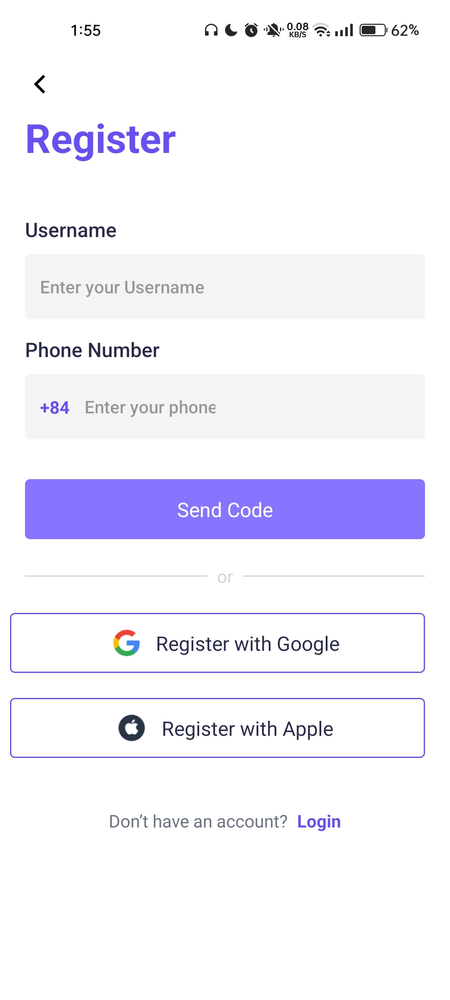 
    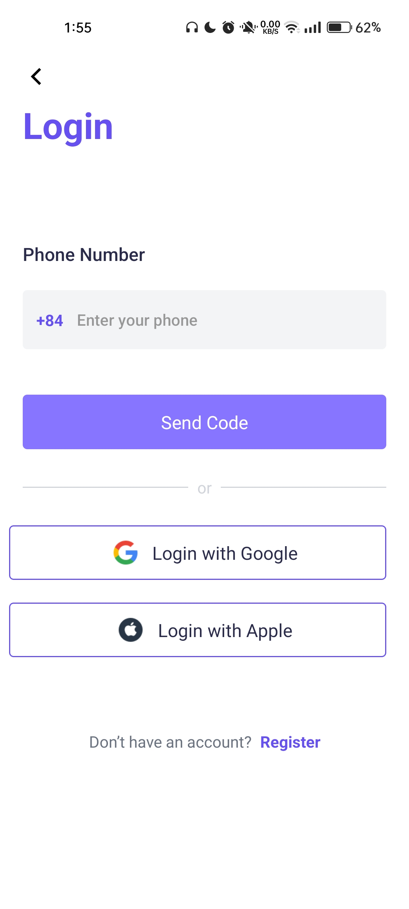
     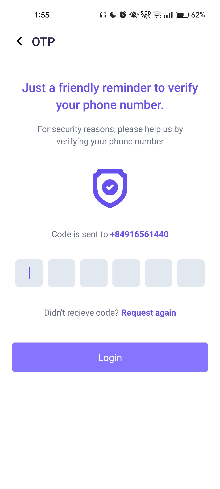

## Add Tasks and Habits

Users can add tasks and habits to the app by clicking on the "Add Task" or "Add Habit" button. They can set deadlines, reminders, and notes for each task.

    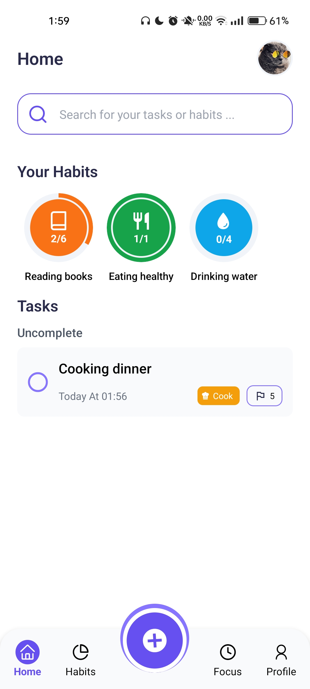 
    
    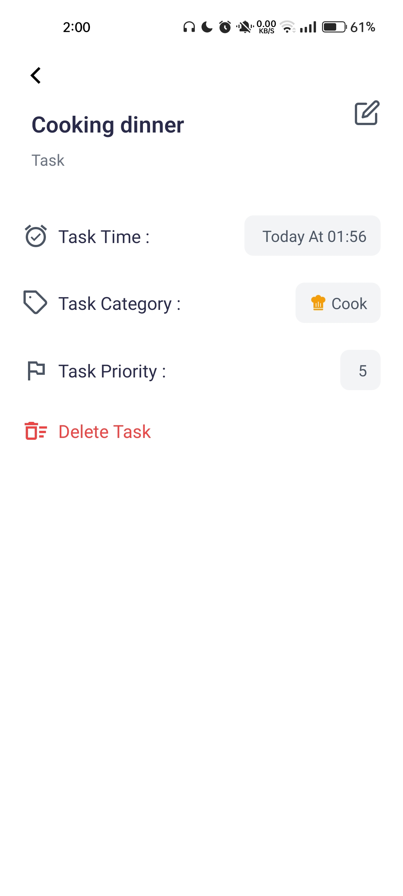

For habits, users can switch to the "Habit" tab and add their habits. The app will remind users to do their habits at the scheduled time.

    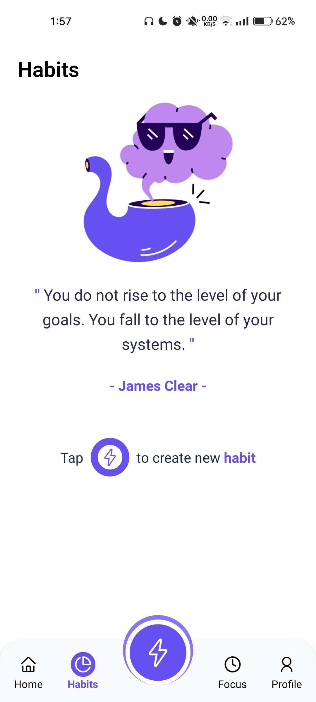 
    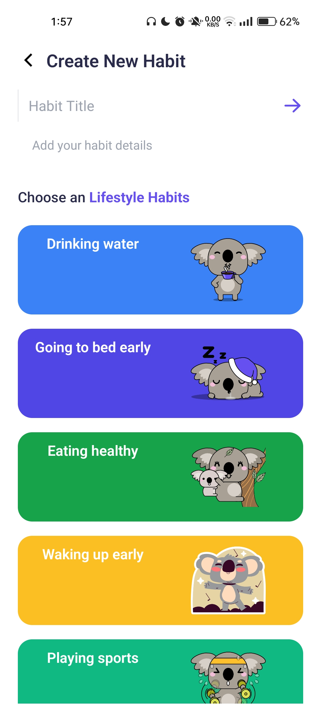
    
     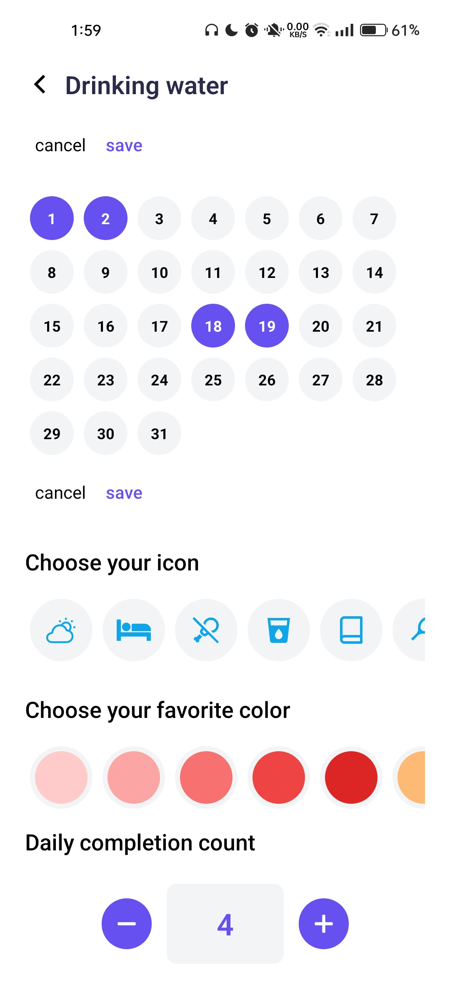

## View and Track Progress

Users can view and track their progress for both tasks and habits in the app. They can mark tasks as completed or postpone them to a later time. They can also mark habits as done or skip them if necessary.

     

## Statistics for Habits

The app provides users with detailed statistics for their habits. They can view graphs and charts that show their progress over time. The app also records the number of times the user has completed their habit and displays it in the statistics section.

     

## Focus Mode

The Focus Mode feature in UpTodo helps users improve their productivity by allowing them to focus on their tasks without distractions. When users activate Focus Mode, they will be prompted to set a specific time interval for their focus session.

During the focus session, the app will hide all non-essential information and display only the task at hand. Users can also switch between focus and break intervals to improve their productivity.

To activate Focus Mode, users can follow these steps:

1. Open the focus screen.
2. Click on the "Focus Mode" button.
3. Set the desired focus and break intervals.
4. Click on the "Start" button to begin the focus session.

The app will display a countdown timer during the focus session to help users track their progress. Once the session is over, users can choose to continue with another session or return to their normal view.

With Focus Mode, users can achieve their goals and improve their productivity with ease.

     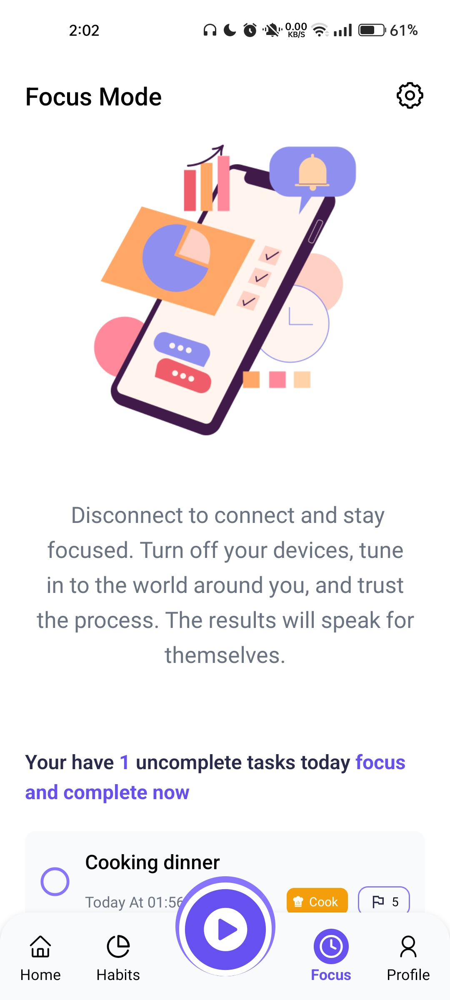
     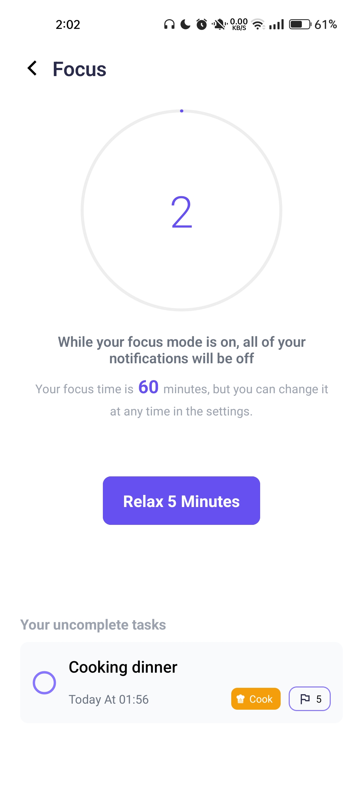

## Search for Tasks and Habits

Users can search for tasks and habits by using the search bar. They can search by name, date, or other criteria.

     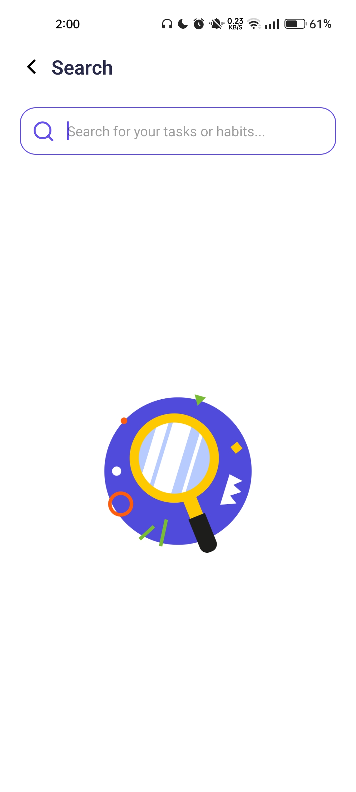

## User Profile

You can access your User Profile by clicking on your username in the top right corner of the app

     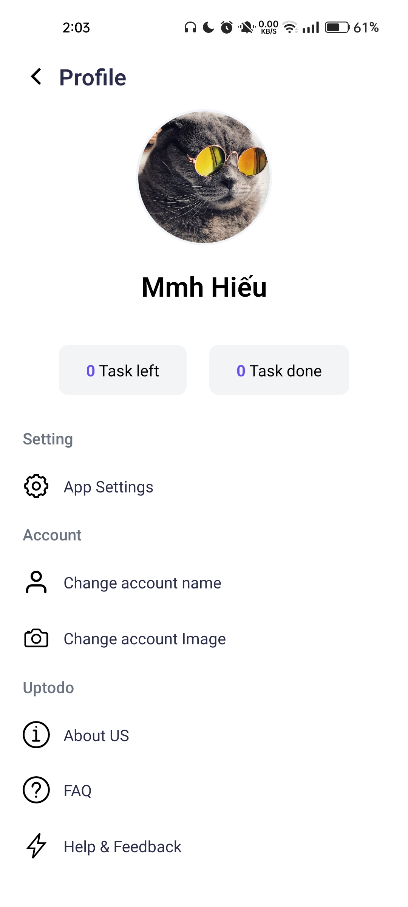

In the User Profile, you can view your personal information, modify your profile, and view your activity history, app setting,
